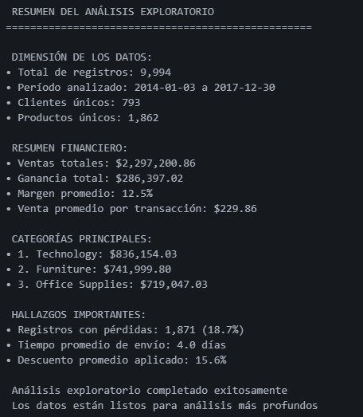
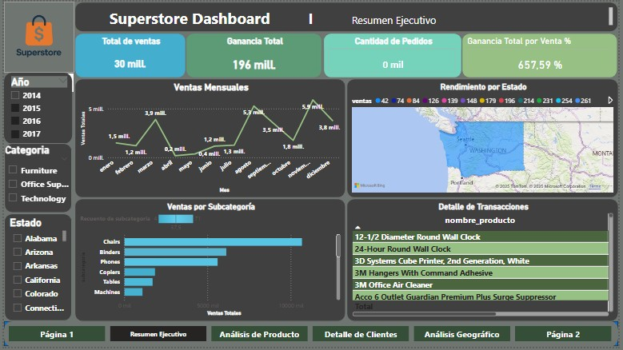
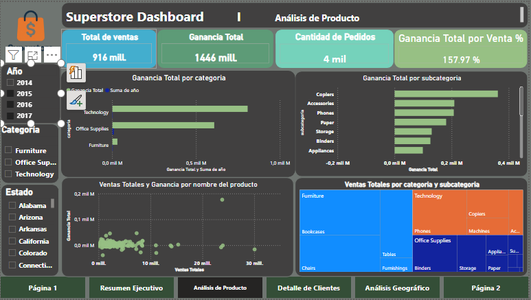
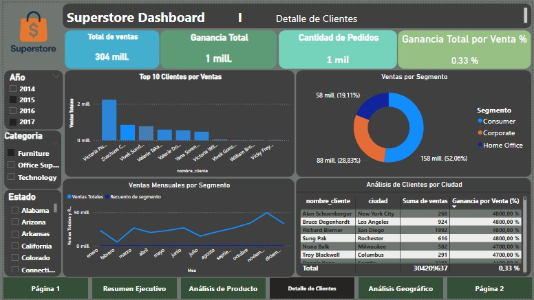
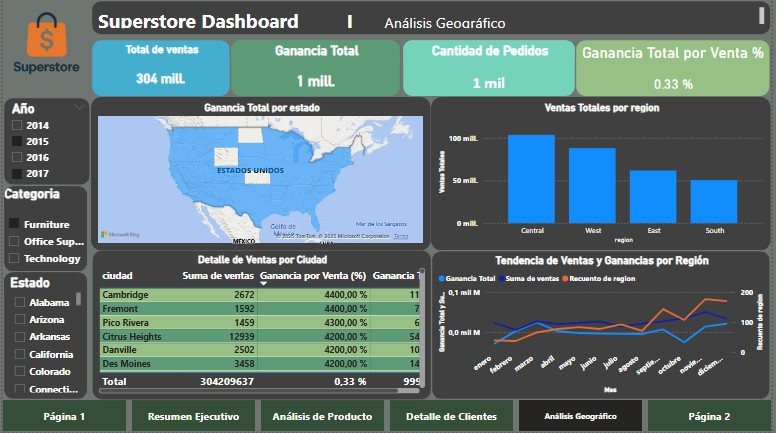

# Análisis de Datos del Superstore Dataset

## Descripción del Proyecto
# Análisis de Datos del Superstore Dataset

## Descripción del Proyecto
Este proyecto utiliza el popular “Superstore Dataset”, disponible en Kaggle y ampliamente usado en la industria y educación para análisis de datos comerciales y visualización. Aquí tienes un resumen sobre el proyecto y sus posibilidades:
## Resultados y Dashboard

A continuación, se presentan los principales hallazgos visuales del análisis, en el orden recomendado para el dashboard:

1. **Exploración de Datos (EDA)**
   
   
   
   Resumen visual de la estructura y calidad de los datos, identificando patrones generales y posibles outliers.

2. **Gráfico 2**
   
   
   
   Visualización específica de ventas, ganancias o distribución relevante según el análisis.

3. **Gráfico 3**
   
   
   
   Análisis detallado de categorías, segmentos o correlaciones clave.

4. **Gráfico 4**
   
   
   
   Profundización en tendencias temporales, geográficas o de rentabilidad.

5. **Dashboard Final**
   
   
   
   Integración de los principales indicadores y visualizaciones en un solo panel para toma de decisiones.

---

## Datos

## Resultados Esperados

- Dashboards interactivos con métricas clave.
- Reportes detallados sobre patrones de ventas y comportamiento de clientes.
- Recomendaciones basadas en datos para mejorar la rentabilidad y la toma de decisiones.
- Modelos predictivos para forecasting de ventas y optimización de estrategias comerciales.

## Contribuciones

Este proyecto forma parte de nuestro análisis de datos empresariales. Las contribuciones son bienvenidas siguiendo las mejores prácticas de análisis de datos y documentación.

¿Qué es el Superstore Dataset?
Dataset de ventas de una tienda ficticia grande, inspirada en datos reales de Tableau.

Contiene información detallada sobre cada venta, incluyendo:

Fecha de pedido y envío.

Cliente, segmento y localización.

Producto, categoría, subcategoría y cantidad.

Modo de envío, descuento, ventas y beneficio.

¿Para qué sirve este dataset?
Permite responder preguntas comerciales relevantes, tales como:

¿Qué productos generan más ventas o beneficios?

¿Qué segmentos de clientes o regiones son más rentables?

¿Qué categorías o subcategorías tienen márgenes negativos y podrían evitarse?

¿Cuál es el efecto de los descuentos en las ganancias?

¿Cuál es la composición del portafolio de productos más eficiente para la tienda?

Posibilidades de Análisis
Análisis descriptivo: identificar productos/segmentos/regiones más y menos rentables.

Segmentación de clientes para campañas personalizadas.

Modelos de predicción: por ejemplo, usando regresión para anticipar ventas o ganancias según variables relevantes.

Simulación de estrategias, como reducir descuentos en categorías con pérdida o centrarse en regiones de alto crecimiento.
En este proyecto realizamos un análisis exhaustivo del dataset Superstore, que contiene información sobre ventas, productos, clientes y ganancias de una tienda de suministros de oficina. Nuestro objetivo es extraer insights valiosos que permitan entender patrones de ventas, comportamiento de clientes y oportunidades de mejora.

## Estructura del Proyecto

```
├── data/
│   └── Sample - Superstore.csv     ← Archivo original de datos
│
├── notebooks/
│   ├── 01_exploracion_datos.ipynb  ← Análisis exploratorio inicial (EDA)
│   ├── 02_visualizaciones.ipynb    ← Gráficos y análisis visual
│   └── 03_modelos.ipynb            ← Modelos estadísticos o ML si aplica
│
├── scripts/
│   └── utils.py                    ← Funciones auxiliares para limpieza, etc.
│
├── outputs/
│   ├── graficos/                   ← Gráficos generados
│   └── reportes/                   ← Tablas, informes en PDF o HTML
│
├── requirements.txt                ← Lista de librerías necesarias
├── README.md                       ← Descripción del proyecto
└── .gitignore                      ← Archivos a ignorar por Git
```

## Datos

El dataset contiene las siguientes columnas principales traducidas al español:
- **id_fila**: Identificador único de cada fila
- **id_pedido**: Identificador del pedido
- **fecha_pedido**: Fecha en que se realizó el pedido
- **fecha_envio**: Fecha de envío del producto
- **modo_envio**: Tipo de envío utilizado
- **id_cliente**: Identificador único del cliente
- **nombre_cliente**: Nombre completo del cliente
- **segmento**: Segmento del cliente (Consumer, Corporate, Home Office)
- **pais**: País de la venta
- **ciudad**: Ciudad de la venta
- **estado**: Estado o provincia
- **codigo_postal**: Código postal
- **region**: Región geográfica
- **id_producto**: Identificador único del producto
- **categoria**: Categoría principal del producto
- **subcategoria**: Subcategoría del producto
- **nombre_producto**: Nombre completo del producto
- **ventas**: Monto de ventas
- **cantidad**: Cantidad vendida
- **descuento**: Descuento aplicado
- **ganancia**: Ganancia obtenida

## Objetivos del Análisis

1. **Análisis Exploratorio**: Entendemos la estructura y calidad de los datos
2. **Análisis de Ventas**: Identificamos patrones temporales y geográficos
3. **Análisis de Productos**: Determinamos los productos más rentables
4. **Análisis de Clientes**: Segmentamos clientes y analizamos su comportamiento
5. **Análisis de Rentabilidad**: Identificamos oportunidades de mejora

## Instalación y Configuración

1. Clonamos el repositorio:
```bash
git clone <url-del-repositorio>
cd superstore-analisis-datos
```

2. Creamos un entorno virtual:
```bash
python -m venv venv
venv\Scripts\activate  # En Windows
source venv/bin/activate  # En Linux/Mac
```

3. Instalamos las dependencias:
```bash
pip install -r requirements.txt
```

4. Iniciamos Jupyter Notebook:
```bash
jupyter notebook
```

## Uso

1. **Exploración inicial**: Comenzamos con `01_exploracion_datos.ipynb` para entender los datos
2. **Visualizaciones**: Utilizamos `02_visualizaciones.ipynb` para crear gráficos informativos
3. **Modelado**: Aplicamos modelos en `03_modelos.ipynb` si es necesario

## Resultados Esperados

- Dashboards interactivos con métricas clave
- Reportes detallados sobre patrones de ventas
- Recomendaciones basadas en datos para mejorar la rentabilidad
- Modelos predictivos para forecasting de ventas

## Contribuciones

Este proyecto forma parte de nuestro análisis de datos empresariales. Las contribuciones son bienvenidas siguiendo las mejores prácticas de análisis de datos.
